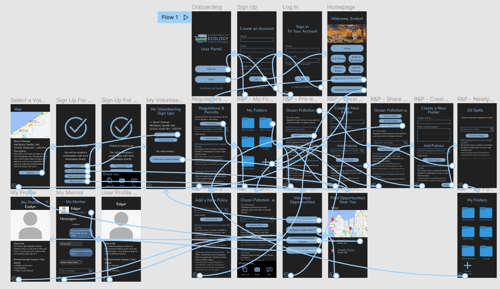
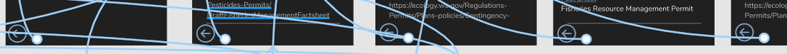
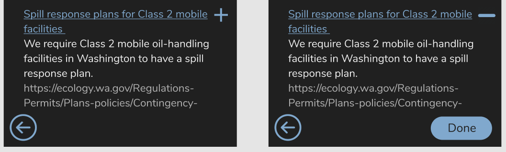

# Assignment 07: High-Fidelity Prototype
**Author:** Evelyn Hu  
**Course:** DH110 User Interface and Design

## Purpose of High-Fidelity Prototyping
High-fidelity prototyping is an important step in user experience design, as it allows the designer to visualize an app's interface as well as how it can be interacted with. It is a step up from low-fidelity prototyping with one important distinction: it allows designers to concretely visualize the flow of the different interfaces. It is very useful in allowing the designer to see the wireflow, as they are able to have users test the high-fidelity prototype, and use the feedback they receive to modify and improve their design even more. Overall, high-fidelity prototypes are a key tool in the designing and testing of a product, as they allow for users to evaluate the product before it is finalized, and give the designer important feedback regarding potential design and usability improvements.  

## About the Prototype
This is a high-fidelity prototype of a Washington State Department of Ecology User App. This prototype was created using Figma. It was created by taking into considerations the needs of two previously designed personas, Ralph and Kimberley. These screens and components were based off of previously created low-fidelity wireframes and includes improvements based on feedback received from peers.  
This prototype allows users to complete the following tasks:
- Organize permits and regulations into folders
- Add new regulations and permits to pre-existing
- Create new folders and populate it with regulations and permits
- Share folders with others
- Find volunteering opportunities
- Sign up for a volunteering opportunity
- Share a volunteering opportunity you've signed up for with others
- View a list of volunteering opportunities you've signed up for
- View your and others' profiles
- Message an environmental mentor

## Washington State Department of Ecology User App Prototype
The interactive high-fidelity prototype can be accessed [here](https://www.figma.com/proto/YlxbVbvTJWaARPeR9iDAQ7/DH110-Assignment-6-Interface-Design-(Copy)?node-id=2%3A2&scaling=scale-down&page-id=0%3A1&starting-point-node-id=2%3A2).

## Wireflow
 

## Revisions
1. In the user testing, my users noted that there were missing back buttons and that it was difficult to get back to the previous page in some cases. When I created the low-fidelity prototypes, I had in mind that usually when trying to go to the previous page on an app, one would try to swipe backwards, which is why I forgot about the importance of back buttons. However, because you can't swipe to go backwards in these prototypes, I made sure to go back and add back buttons or escape options for every single wireframe in the prototype.  
 

2. Though this was not noted by my users, as I was creating the prototype of the section of the app where you can add policies to a folder, I realized that there was no visual indication that you have successfully added a policy. This is similar to a case in Apple's Music app, where you can tap on a plus sign to add a song to a playlist, but once you tap on the plus, there is no change and I am often left confused about whether or not the song was successfully added to my playlist. Therefore, I wanted to ensure that there is visual indication that a policy was successfully added, and I did so by having the plus sign change to a minus sign (which can then be tapped to remove a policy if it were, for example, added by mistake). This would successfully convey to the user that the policy was indeed added to a folder.  
 
